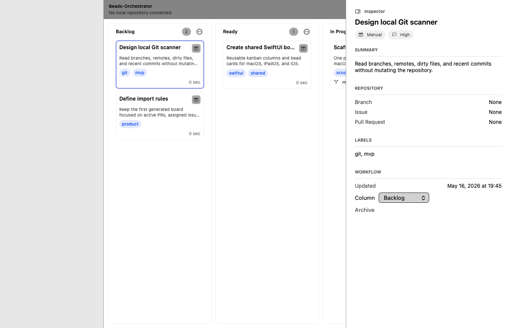
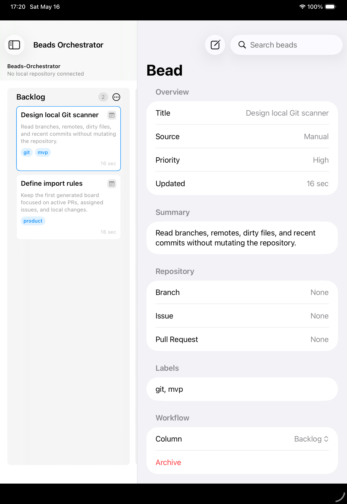
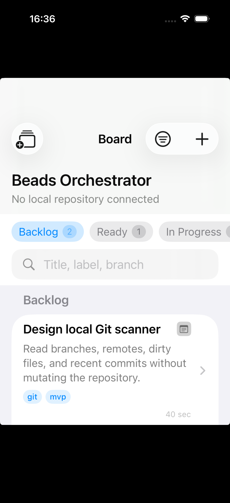

# Beads-Orchestrator

Beads-Orchestrator is a native SwiftUI app for managing repository work as a visual kanban board. It treats each unit of work as a "bead" and lets you scan, triage, edit, and move those beads across workflow columns on macOS, iPadOS, and iOS.

The project is intentionally built as a single Xcode project with shared product code compiled into each client. Code reuse between platforms is a core requirement, not an afterthought.

## Current Status

This is an early buildable MVP. It includes the shared SwiftUI board experience, native macOS and iOS/iPadOS targets, local JSON persistence, local Git import scaffolding, and a Mac-hosted HTTP server that mobile clients can pair with over a local network or Tailscale.

The macOS app is the canonical source of truth. iPhone and iPad clients are views over that server state with local caching and authenticated mutation requests.

## Screenshots

### macOS

<p>
  
</p>

### iPadOS And iOS

<p>
  
  
</p>

## Features

- SwiftUI kanban board shared across macOS, iPadOS, and iOS.
- Adaptive layouts for desktop, iPad landscape/portrait, and compact iPhone screens.
- Board, column, and bead models with JSON persistence in Application Support.
- Bead creation, editing, column movement, archive flow, source filters, search, and attention filters.
- macOS local Git source scanning for branch, changed files, recent branches, and recent commits.
- Mac-hosted local HTTP server on port `8787`.
- QR pairing from the Mac app to iPhone/iPad clients.
- Bearer-token authorization for board reads and writes.
- Manual mobile connection setup for local-network and Tailscale use.

## Architecture

The app is organized around one Xcode project:

- `Beads-Orchestrator.xcodeproj`: single project containing all app targets.
- `Apps/macOS`: macOS app entry point and platform-specific setup.
- `Apps/iOS`: iOS/iPadOS app entry point, app metadata, camera and local-network permissions.
- `BeadsOrchestratorShared/Models`: board, column, bead, and metadata types.
- `BeadsOrchestratorShared/ViewModels`: board state, persistence, selection, and sync orchestration.
- `BeadsOrchestratorShared/Views`: reusable SwiftUI board, card, sidebar, detail, and connection UI.
- `BeadsOrchestratorShared/Services`: local Git/GitHub source boundaries plus Mac server/client networking.
- `clients/go`: cross-platform Go clients kept outside the Xcode project, including a Fyne UI and CLI.
- `docs`: product and implementation planning notes.
- `.beads`: beads issue-tracking data for project tasking.

## Targets

- `Beads-Orchestrator macOS`: native macOS app and canonical board server.
- `Beads-Orchestrator iOS`: adaptive iPhone and iPadOS client from one SwiftUI target.

Deployment targets:

- iOS/iPadOS `17.0`
- macOS `14.0`

## Mac Server

The macOS app starts a small local HTTP server for paired clients. The server is intended for trusted local-network or Tailscale use.

Endpoints:

- `GET /health`: unauthenticated server status and capability metadata.
- `GET /auth/verify`: verifies the bearer pairing token.
- `GET /boards`: returns the canonical board snapshot.
- `PUT /boards`: replaces the canonical board snapshot with a client mutation.

The QR pairing payload contains:

- server URL, for example `http://my-mac.local:8787`
- bearer pairing token

Security notes:

- The current server is HTTP-only and intended for local/Tailscale networks.
- The pairing token can be regenerated from the Mac app.
- Future hardening should include per-device tokens, Keychain-backed credential storage, conflict-aware sync, and optional TLS for non-Tailscale deployments.

## Requirements

- macOS with Xcode installed.
- Xcode 15.3 or newer is recommended.
- SwiftUI support for iOS 17 and macOS 14.

## Build

Open `Beads-Orchestrator.xcodeproj` in Xcode and build one of the schemes:

- `Beads-Orchestrator macOS`
- `Beads-Orchestrator iOS`

Verified CLI builds:

```sh
xcodebuild -project Beads-Orchestrator.xcodeproj -scheme "Beads-Orchestrator macOS" -configuration Debug -destination 'platform=macOS' build
xcodebuild -project Beads-Orchestrator.xcodeproj -scheme "Beads-Orchestrator iOS" -configuration Debug -destination 'generic/platform=iOS Simulator' build
```

## Go Clients

The repository also includes standalone Go clients under `clients/go`. They are not referenced by `Beads-Orchestrator.xcodeproj`, so Xcode ignores them.

```sh
cd clients/go
make all
```

This builds:

- `bin/beads-ui`: Fyne desktop UI for the Mac server.
- `bin/beadsctl`: CLI for health checks, board listing, snapshot import/export, and simple bead mutations.

## Pairing A Mobile Client

1. Run the macOS app.
2. Open the server menu in the macOS toolbar.
3. Show or copy the pairing payload.
4. On iPhone or iPad, open the connection sheet.
5. Scan the QR code or enter the server URL and token manually.
6. Verify the connection, then sync.

## Product Direction

Beads-Orchestrator is designed for developers who want a repo-centered board that blends manual planning with code context. Near-term work should focus on:

- conflict-aware snapshot sync
- stronger mobile offline caching
- richer bead metadata from local Git and GitHub
- drag and drop across all platforms
- keyboard shortcuts on macOS and iPadOS
- durable authentication storage
- deeper HIG/HCS polish for dense productivity workflows

See `PRD.md` for the product requirements and `docs/IMPLEMENTATION_PLAN.md` for implementation slices.

## License

Beads-Orchestrator is available under the MIT License. See `LICENSE`.
